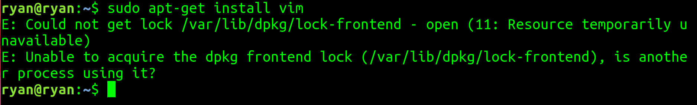

### ERROR: apt-get install

</img

해결 방법
```
sudo killall apt apt-get

sudo rm /var/lib/apt/lists/lock
sudo rm /var/cache/apt/archives/lock
sudo rm /var/lib/dpkg/lock*

sudo dpkg --configure -a

sudo apt update
```
